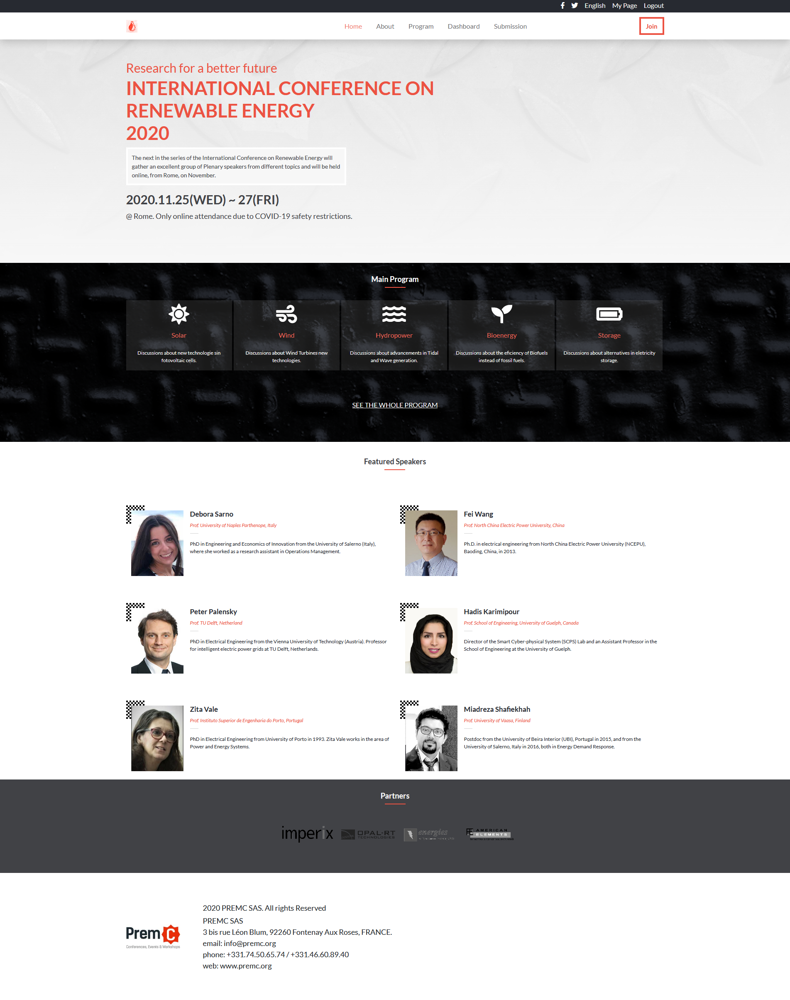

# HTML & CSS 2.0 - Project 4: Capstone Project - Conference Page

This is the Capstone project in Microverse's HTML and CSS module. It consists of the creation of a page based on this guide [Cindy Shin in Behance](https://www.behance.net/gallery/29845175/CC-Global-Summit-2015) using Boostrap and the preprocessor SASS.
It consists of 3 pages (Main, About and Tickets), designed using the layout, colors and fonts shown on the design guide.
I used Responsive Web Design techniques to style all 3 pages according to the device is being used.
It has 1 breakpoint being style for Mobile Screens and Desktop Screens. I also used grid and flexbox techniques so the elements within the page would ajust to changes in the viewport size.
For the content I based the page on the International Conference on Renewable Energies held in 2020. Used only as an example, not all information is factual.

## Built With

- HTML 5
- CSS 3
- SASS
- Bootstrap 5.0

## Live Demo

[HTML & CSS 2.0 - Project 4: Capstone Project - Conference Page - Main](https://jpdf00.github.io/capstone-project/)

## Getting Started

Visit the live version on the link above.

To get a local copy up and running follow these simple example steps:

- Download the .zip file to your machine, extract everything and open the index.html file in your browser.

## Authors

👤 **João Paulo Dias França**

- GitHub: [@jpdf00](https://github.com/jpdf00)
- Twitter: [@jpdf00](https://twitter.com/JooPauloDiasFr1)
- LinkedIn: [João Paulo Dias França](https://www.linkedin.com/in/jo%C3%A3o-paulo-dias-fran%C3%A7a-269257a4/)

## 🤝 Contributing

Contributions, issues, and feature requests are welcome!

Feel free to check the [issues page](https://github.com/jpdf00/capstone-project/issues).

## Show your support

Give a ⭐️ if you like this project!

## Acknowledgments

- Design by [Cindy Shin in Behance](https://www.behance.net/gallery/29845175/CC-Global-Summit-2015)
- Based on the International Conference on Renewable Energies held in 2020. Used only as an example, not all information is factual.

## 📝 License

This project is [MIT](https://opensource.org/licenses/mit-license.php) licensed.
